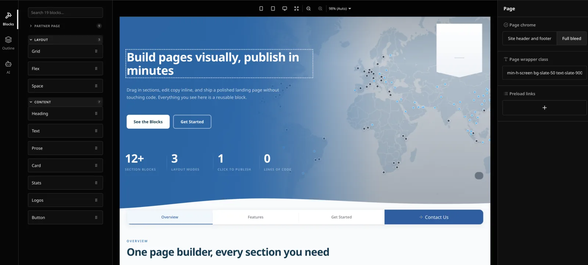

# emdash-plugin-puck

The [Puck](https://puckeditor.com/) visual editor as an [EmDash](https://github.com/emdash-cms/emdash) plugin.

It registers one field widget, `puck:canvas`, that takes over any `json` field and edits it with Puck instead of a raw JSON textarea. The stored value is Puck `Data` (`{ root, content, zones? }`), and the same package renders it on the public site.

- Full-screen editor overlay with Cancel / Save layout and an unsaved-changes guard
- A searchable block panel with live hover previews, rendered from each block's real `defaultProps`
- Puck's chrome themed onto the EmDash admin's design tokens, so it follows the admin's light and dark mode
- `mediaField()`: the EmDash media library (browse, search, upload) as a Puck field
- A starter kit of ten composable blocks (Grid, Flex, Space, Heading, Text, Prose, Card, Stats, Logos, Button), ported from Puck's demo app
- Public rendering with per-section error boundaries, so one broken block costs one section and not the page
- Optional Puck AI: the chat panel in the editor, plus the authenticated Puck Cloud route behind it



Extracted from a production marketing CMS. Every non-obvious decision is explained in the source next to the code it protects.

## Requirements

| | |
| --- | --- |
| EmDash | `>=0.35 <0.37` |
| Puck | `@puckeditor/core` 0.23 |
| React | 18 or 19 |
| Astro | 5, 6 or 7 (the AI route is an Astro `APIRoute`) |

```bash
npm install emdash-plugin-puck @puckeditor/core
# for Puck AI:
npm install @puckeditor/plugin-ai @puckeditor/cloud-client
```

## Setup

Six steps. The site owns three small files: the admin entry, the Puck config and the render island.

**1. Install**

```bash
npm install emdash-plugin-puck @puckeditor/core@0.23
npm install @puckeditor/plugin-ai @puckeditor/cloud-client   # only for Puck AI
```

**2. Register the plugin** in `astro.config.mjs`

```js
import emdash from "emdash/astro";
import puck from "emdash-plugin-puck";

export default defineConfig({
  integrations: [
    emdash({
      plugins: [
        puck({ adminEntry: new URL("./src/puck/admin.tsx", import.meta.url).href }),
      ],
    }),
  ],
  vite: {
    optimizeDeps: {
      // Required. Add "@puckeditor/plugin-ai" if used, and every bare
      // dependency your blocks import. See "optimizeDeps" below.
      include: ["@puckeditor/core"],
    },
  },
});
```

`adminEntry` is your file (step 3), as an absolute URL string: EmDash inlines it into a generated virtual module that cannot resolve a relative path.

**3. Write the admin entry** at `src/puck/admin.tsx`

```tsx
import { createPuckAdmin } from "emdash-plugin-puck/admin";
import { config } from "./config";

export const { fields } = createPuckAdmin({ config });
```

If your blocks depend on site CSS, add `canvas: { stylesheets: [href], css: "...", colorScheme: "light" }`; see [Styles in the canvas](#styles-in-the-canvas).

**4. Write the Puck config** at `src/puck/config.tsx`. The quickest start is the bundled kit:

```tsx
import type { Config } from "@puckeditor/core";
import { createBlocks } from "emdash-plugin-puck/blocks";
import "emdash-plugin-puck/blocks.css";

const kit = createBlocks();

export const config: Config = {
  categories: { ...kit.categories },
  components: { ...kit.components },
};
```

Add your own blocks beside them. Use `mediaField("Image")` from `emdash-plugin-puck/fields` for image props, and `Editable` from `emdash-plugin-puck/render` for any prop with `contentEditable: true`. See [Starter blocks](#starter-blocks) and [Writing blocks](#writing-blocks).

**5. Point a `json` field at the widget.** In a seed:

```json
{ "slug": "layout", "type": "json", "widget": "puck:canvas" }
```

Or on an existing field, over the REST API. `widget` is its own column, so it cannot be set through `options`, the `schema_create_field` MCP tool has no parameter for it, and `PATCH` 404s (`PUT` is the verb):

```bash
curl -X PUT -H "Authorization: Bearer $EMDASH_API_TOKEN" -H "X-EmDash-Request: 1" \
  -H "Content-Type: application/json" -d '{"widget":"puck:canvas"}' \
  http://localhost:4321/_emdash/api/schema/collections/pages/fields/layout
```

`GET /_emdash/api/manifest` (authenticated) shows the widget the admin will use.

**6. Render the page**

```tsx
// src/puck/PuckPage.tsx
import { createPuckPage } from "emdash-plugin-puck/render";
import { config } from "./config";

export default createPuckPage(config);
```

```astro
---
// src/pages/[...slug].astro
import { getEmDashEntry } from "emdash";
import { parseLayout } from "emdash-plugin-puck/render";
import PuckPage from "../puck/PuckPage";

const { entry, cacheHint } = await getEmDashEntry("pages", Astro.params.slug!);
if (!entry) return Astro.rewrite("/404");
if (cacheHint && Astro.cache?.enabled) Astro.cache.set(cacheHint);

const layout = parseLayout(entry.data.layout);
---
<Layout>
  {layout && (
    <div {...entry.edit.layout}>
      <PuckPage client:load data={layout} />
    </div>
  )}
</Layout>
```

`client:load` is required: the whole document is one island that server-renders first and then hydrates. The config cannot be an island prop (it holds React components), which is what `createPuckPage` is for. Any block module that touches `window` at module scope must use a dynamic `import()`.

**Optional: Puck AI.** Add `puckAi()` to the admin entry, a route, and the key:

```tsx
// src/puck/admin.tsx
import { puckAi } from "emdash-plugin-puck/ai";
const ai = puckAi(); // module scope
export const { fields } = createPuckAdmin({ config, ...ai });
```

```ts
// src/pages/api/puck/[...all].ts   (path fixed by Puck's client)
import { createPuckAiHandler } from "emdash-plugin-puck/ai/handler";
const handler = createPuckAiHandler({ context: "You write pages for ..." });
export const GET = handler;
export const POST = handler;
export const DELETE = handler;
```

Set `PUCK_API_KEY` in the environment. See [Puck AI](#puck-ai), including the second island needed for design mode.

**Verify**

1. `astro check` and `astro build` pass.
2. Open the admin, edit an entry: the field shows "Edit layout", the overlay opens with your blocks listed, save writes `{ root, content }` to the field.
3. The public route renders the page, and the browser console shows no `[puck]` boundary errors.
4. If the admin sits on "Loading EmDash…", a dependency is missing from `optimizeDeps.include` (check the console for a failed `PluginRegistry` import).

### Migrating from an inline plugin

If the site carries an earlier copy of this code under `src/plugins/puck/`: delete `index.ts`, `BlockPanel.tsx` and `puck-theme.css`; replace the descriptor in `astro.config.mjs` with `puck({ adminEntry })`; reduce `admin.tsx` to the `createPuckAdmin` call above, passing the stylesheets it used to inject as `canvas` / `blockPanel` options; replace local `PuckPage.tsx` / `PuckPageDesigned.tsx`, `boundaries.tsx`, `ErrorBoundary.tsx`, `editable.ts` and `fields/media.tsx` with the package exports; and reduce the AI route to `createPuckAiHandler`, keeping only the site's `context` and `designMode.instructions`.

## Styles in the canvas

Puck renders the editor canvas in an iframe, and its `syncHostStyles` copies only the **admin** document's stylesheets across. Your site's CSS is never there on its own. Pass it in:

```tsx
import siteCssHref from "../styles/globals.css?url";
import tokensCss from "../styles/tokens.css?raw";

export const { fields } = createPuckAdmin({
  config,
  canvas: {
    stylesheets: [siteCssHref],
    css: tokensCss,
    colorScheme: "light",
  },
});
```

Three things here cost real debugging time:

**Tailwind must go in compiled, as a `<link>`.** The admin is itself a Tailwind app, so utilities the two builds happen to share resolve while every site-specific one silently does not (`max-w-7xl` computed to `max-width: none`, `text-slate-900` to the admin's near-white). Sections come out structurally right and visually wrong. And the Tailwind entry cannot be `?raw`: that returns the unprocessed source, whose first line is `@import "tailwindcss"`, which no browser can resolve.

**`?url` is right for a build and wrong in dev, for project source.** Vite's dev server answers a `?url` import of your own CSS with a JS module, and a `<link rel="stylesheet">` pointing at that loads nothing. `?direct` is the dev form that serves real `text/css`, and it does not survive a build. So pick one at bundle time:

```ts
export const SITE_CSS_HREF = import.meta.env.DEV
  ? "/src/styles/globals.css?direct"
  : siteCssHref;
```

Prebuilt package assets (this package's own sheets, Puck's) do not need this.

**Pin `colorScheme` on a light-only site whose tokens use `light-dark()`.** Otherwise a machine set to dark mode paints the canvas body dark behind sections designed for a light page.

Also on by default: `unlockScroll`. Puck pins the canvas body with inline `overflow: hidden` plus a fixed pixel height, and the frame is `height: 100%`, so a document taller than the viewport cannot be scrolled and the Outline panel becomes the only way around it. The widget clears that.

The block panel's preview iframe takes the same styles by default; pass `blockPanel: { ... }` to override, or `blockPanel: false` to keep Puck's stock drawer.

## Starter blocks

`emdash-plugin-puck/blocks` ships ten composable blocks in two categories: **Layout** (Grid, Flex, Space) and **Content** (Heading, Text, Prose, Card, Stats, Logos, Button). Every block carries a parent-aware `layout` field (column span inside a Grid, grow inside a Flex, vertical padding elsewhere), inline-editable copy, closed token selects instead of free numbers, and Puck AI instructions.

```tsx
const kit = createBlocks({
  // Card icons: a closed vocabulary you supply. Without it the Card has no icon field.
  icons: { options: [{ label: "Globe", value: "globe" }], render: (key) => <Icon name={key} /> },
  // Rewrite author-typed hrefs (a base path, say). Default: identity.
  resolveHref: withBase,
  // Your own full-width sections, which must not be dropped inside a Grid or Flex cell.
  disallow: ["Hero", "Footer"],
  // Extra Button actions beside "Go to a link". Picking one hides the href field.
  buttonActions: [{ value: "contact", label: "Open contact form", onClick: openDrawer }],
  // Wear the site's own button classes instead of the package's `zk-btn`.
  buttonClassName: (variant, size) => `btn btn-${variant}${size === "large" ? " btn-lg" : ""}`,
  // Replace the spacing, gap or width scales.
  options: { maxWidth: [{ label: "Wide", value: "1200px" }] },
});
```

**The stylesheet loads in three places.** `import "emdash-plugin-puck/blocks.css"` from your config puts it on the public page and on the admin document, which Puck copies into the canvas. The block panel's preview iframe is a separate document, so also pass it raw in the admin entry:

```tsx
import blocksCss from "emdash-plugin-puck/blocks.css?raw";
export const { fields } = createPuckAdmin({ config, blockPanel: { css: blocksCss } });
```

**Styling.** Every colour, size and radius in `blocks.css` reads a `--zk-*` variable, then a conventional site token (`--color-text`, `--color-brand`, `--font-size-lg`, `--site-radius`), then a literal. A site that already declares those tokens gets its own look with no configuration; any site can retune the blocks by declaring `--zk-*` on `:root`; a bare site is still presentable. The classes are plain (`zk-grid`, `zk-card`) rather than CSS modules because the preview iframe receives the sheet as raw text.

**The registry keys must stay `Grid` and `Flex`.** The layout field narrows itself by the parent's registry name, so renaming either loses the span and grow controls.

## Media

Replace the plain URL text box on every image prop:

```ts
import { mediaField } from "emdash-plugin-puck/fields";

fields: {
  image: mediaField("Image"),
  logo: mediaField("Logo", "Empty renders the name as a wordmark"),
}
```

It stores exactly what a text field would store, a URL string, so nothing downstream changes. Values keep the proxy shape (`/_emdash/api/media/file/<key>`); if your public build rewrites them to a CDN, do that on the way out in `parseLayout`'s `transform`, not in the data.

One known blind spot: EmDash's media-usage extractor walks `image`, `file`, `repeater` and `portableText` fields only. A URL stored inside a `json` layout is invisible to it, so every asset used by a Puck page reads as used-nowhere in the media library. Nothing deletes those files, but "where is this used" under-reports.

## Puck AI

Two halves, and both are opt-in.

```tsx
// src/puck/admin.tsx
import { createPuckAdmin } from "emdash-plugin-puck/admin";
import { puckAi } from "emdash-plugin-puck/ai";
import { config } from "./config";

const ai = puckAi(); // module scope, or the chat remounts on every render

export const { fields } = createPuckAdmin({ config, ...ai });
```

```ts
// src/pages/api/puck/[...all].ts
import { createPuckAiHandler } from "emdash-plugin-puck/ai/handler";

const handler = createPuckAiHandler({
  context: "You write pages for ... (positioning, audience, voice, hard rules)",
  designMode: { allowed: true, instructions: "Match the existing site surfaces ...", scripts: false },
});

export const GET = handler;
export const POST = handler;
export const DELETE = handler;
```

**The route path is fixed.** Puck's client calls `/api/puck/*` by convention and exposes only `host` (a different origin), so the file has to live exactly there.

**That route spends money.** Every generation debits credit from the Puck Cloud account behind `PUCK_API_KEY`, billed to the account and not the caller. The handler refuses anything without an EmDash session (`locals.user`, which EmDash's auth middleware populates on public routes too, from the admin cookie that opened the editor) and anything missing the `X-EmDash-Request: 1` CSRF header the client attaches. A bearer token does not authenticate here. It also logs one line per generation with the user's email, because the Puck Cloud dashboard cannot see which EmDash user ran the prompt; pass `onFinish` to record it elsewhere.

**Generation quality is config, not prompt.** `context` on the handler carries positioning and voice; component-level `ai.instructions` in your config encode placement, cardinality and cross-component references. `mediaField` is a `custom` field, which Puck AI cannot infer anything about, so it declares its own `ai.schema` and is told never to invent a media URL.

### Design mode splits the public render path

Design mode invents new component types and stores them in the document at `root.props._dynamicConfig`. Rendering them needs `withDynamicConfig` from `@puckeditor/plugin-ai`, which is one bundle whose chat runtime does not tree-shake away from that one function: importing it into the ordinary island was measured at 608KB to 1.4MB on every public Puck page. So there are two islands, and the route picks per page:

```tsx
// src/puck/PuckPageDesigned.tsx
import { createPuckPageDesigned } from "emdash-plugin-puck/render/designed";
import { config } from "./config";

export default createPuckPageDesigned(config);
```

```astro
---
import { hasDesignedComponents, parseLayout } from "emdash-plugin-puck/render";
import PuckPage from "../puck/PuckPage";
import PuckPageDesigned from "../puck/PuckPageDesigned";
const layout = parseLayout(entry.data.layout);
---
{hasDesignedComponents(layout)
  ? <PuckPageDesigned client:load data={layout} />
  : <PuckPage client:load data={layout} />}
```

Write that choice as a ternary **in the markup**, never as a variable. Astro finds islands by statically matching `<Component client:* />`, so `const Island = cond ? A : B` with `<Island client:load />` type-checks, builds clean, and emits no client chunk for either. The page then server-renders correctly and silently never hydrates.

## Theming

`emdash-plugin-puck/theme.css` aliases Puck's global `--puck-*` tokens onto the EmDash admin's Kumo tokens, one declaration per token. Kumo's are `light-dark()` pairs keyed off the admin's `data-mode`, so the editor gets the admin's dark mode for free; Puck itself ships none. The sheet is unlayered on purpose: Puck declares its tokens inside `@layer puck-tokens`, and an unlayered rule beats a layered one at any specificity. That is the entire mechanism. Do not add an `@layer` or `!important` to it.

It is linked automatically, along with Puck's `no-external.css`, when the widget module loads. `no-external.css` rather than `puck.css` because the default sheet's first line is `@import "https://rsms.me/inter/inter.css"`, measured at 850-970ms of render blocking; the theme points `--puck-font-family` at the admin's own face anyway. Pass `adminStylesheets` to change the set.

All stylesheets are linked by URL at runtime rather than imported, on purpose. A static CSS import lands in the module graph of your admin entry, which imports your Puck config, which your public island imports too, and Astro emits a route's `<link>` tags from the whole reachable chunk graph. The editor's chrome ended up on every public page once. `?url` keeps the sheets out of every route's style graph, and they stay real document stylesheets, which is what `syncHostStyles` copies into the canvas.

## optimizeDeps

Vite's dependency scanner crawls the server entry graph, but the Puck admin entry is only reachable through the virtual `emdash/admin-registry` module via an absolute `file://` URL, which the scanner cannot follow. A dependency discovered late gets optimised on a re-scan while the loaded admin chunk still asks for the old hash: Vite answers **504 Outdated Optimize Dep**, and the admin either hangs on "Loading EmDash" or shows "Plugin widget error: Failed to fetch dynamically imported module". It retries green and fails again on the next scan.

Pin `@puckeditor/core`, `@puckeditor/plugin-ai` if you use it, and **every bare dependency any of your blocks imports** in `vite.optimizeDeps.include`. Blocks have the same problem one level down: they are only reachable from your config, which the admin loads through that same unscannable entry.

## Writing blocks

Things the editor's iframe changes about ordinary React:

- **`instanceof` is per-realm.** A library that validates DOM nodes with `container instanceof HTMLElement` (Mapbox does) sees an element owned by the iframe document while it was loaded in the parent window, and throws. Guard with `el.ownerDocument.defaultView !== window` and render a placeholder; that test also covers the block panel's preview iframe, and Puck 0.23 exposes no `isEditing` on render props.
- **A Puck document is a flat list.** No block can open a wrapper that closes after a later block. Anything spanning sections (the `<main>` landmark, inter-section spacing, the page max-width) belongs in `root.render`. `<Render>` inserts an unclassed DropZone `<div>` between the root markup and the blocks, so child combinators do not reach them; use descendant selectors.
- **Inline-editable copy is a React node in the editor.** Type such props `Editable` (exported from `emdash-plugin-puck/render`) and only ever render them. Never pass one to an attribute, test its truthiness, interpolate or compare it: `[object Object]` ships to the DOM, in the editor only, and survives a typecheck.
- **The block panel renders your components bare.** Previews use `defaultProps` plus a stub `puck` prop, so a block that throws on missing data shows "Preview unavailable" rather than taking the panel down. Give every block sensible defaults.
- **Props must be JSON-serialisable.** Icons are string keys resolved at render time, never components.

## API

| Export | From |
| --- | --- |
| `puckPlugin(options)` (default), `createPlugin` | `emdash-plugin-puck` |
| `createPuckAdmin`, `createPuckCanvasField`, `createBlockPanel` | `emdash-plugin-puck/admin` |
| `puckAi` | `emdash-plugin-puck/ai` |
| `createPuckAiHandler` | `emdash-plugin-puck/ai/handler` |
| `createPuckPage`, `parseLayout`, `hasDesignedComponents`, `isPuckData`, `EMPTY_DATA`, `withBoundaries`, `ErrorBoundary`, `BlockErrorBoundary`, `PageErrorBoundary`, `renderable`, `Editable` | `emdash-plugin-puck/render` |
| `createPuckPageDesigned` | `emdash-plugin-puck/render/designed` |
| `mediaField` | `emdash-plugin-puck/fields` |
| `createBlocks`, `withLayout`, `Section`, the option lists and block prop types | `emdash-plugin-puck/blocks` |
| the starter block styles | `emdash-plugin-puck/blocks.css` |
| the admin theme | `emdash-plugin-puck/theme.css` |

`createPuckAdmin` options: `config`, `emptyData`, `plugins`, `resolveConfig`, `canvas` (`stylesheets`, `css`, `colorScheme`, `unlockScroll`), `blockPanel` (preview styles, `previewWidth`, `previewScale`, or `false`), `adminStylesheets`, `overrides`, `labels`.

## License

MIT
